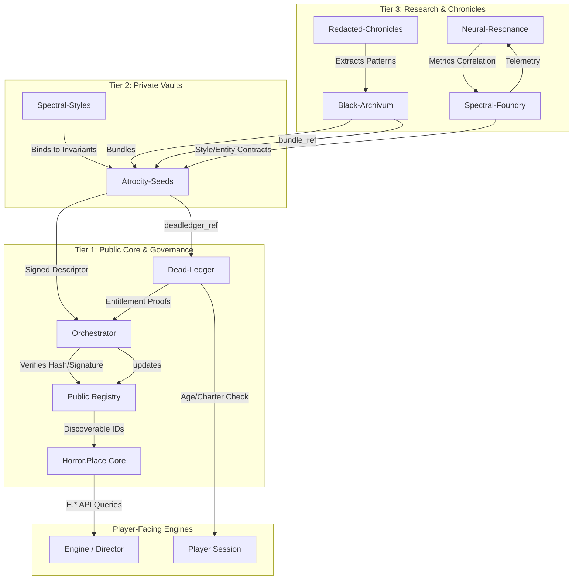

# Constellation Data Flow v1

This document describes the end-to-end data pipeline for the Horror$Place VM-constellation, from invariant creation in the archives to runtime engine behavior.

## 1. High-Level Architecture

The constellation operates on a **contract-first, implication-only** model. Data flows from sealed vaults (Tier 2/3) through a governance and orchestration layer (Tier 1) to reach player-facing engines. At no point do engines query vaults directly.

### 1.1. Pipeline Overview

## 2. Stage-by-Stage Breakdown

### 2.1. Invariant Extraction (Tier 3 → Tier 2)
- **Source:** `HorrorPlace-Redacted-Chronicles` holds raw historical/chronological data (redacted).
- **Process:** Research agents analyze patterns and extract **Invariant Bundles** (`CIC`, `AOS`, `SPR`, etc.) representing the "physics" of an event.
- **Output:** `HorrorPlace-Black-Archivum` stores these bundles as immutable, signed JSON objects.

### 2.2. Seed Generation (Tier 2)
- **Source:** Invariant Bundles + Style Contracts.
- **Process:** PCG algorithms or AI agents (via `ai_file_envelope`) generate **Seeds** (Events, Regions).
- **Constraints:** 
  - Seeds are **implication-only**: no narrative text, only IDs, hashes, and metric intents (`UEC`, `EMD`, etc.).
  - Seeds reference bundles via `bundle_ref`.
  - High-intensity seeds require a `deadledger_ref`.
- **Output:** `HorrorPlace-Atrocity-Seeds` stores the seed contracts and updates the local registry (`registry/events.json`).

### 2.3. Orchestration & Verification (Tier 1)
- **Source:** Atrocity-Seeds Registry + Black-Archivum Bundles.
- **Process:** `Horror.Place-Orchestrator` polls the vault registries.
  1. Fetches the seed contract via `git@` URI.
  2. Verifies SHA-256 hash matches registry entry.
  3. Validates against `eventcontract_v1.json` from Horror.Place.
  4. Checks Dead-Ledger proofs for entitlement.
- **Output:** Orchestrator signs a **Public Descriptor** and updates `Horror.Place` public registries.

### 2.4. Runtime Consumption (Engine)
- **Source:** `Horror.Place` Public Registry.
- **Process:** Game engines use the `H.*` API (e.g., `H.resolve_event(id)`).
  - Engine queries public registry for a region/event.
  - Director reads invariant bindings to determine behavior (e.g., fog density, audio distortion).
  - Director checks Dead-Ledger for player entitlement.
- **Feedback:** Engine emits telemetry (QPU Data Shards) back to `HorrorPlace-Neural-Resonance-Lab` to tune future seeds.

## 3. Key Interfaces

| Interface | Description | Schema |
|-----------|-------------|--------|
| **Seed Contract** | Defines invariant bounds and metric intent for an event/region. | `eventcontract_v1.json` |
| **Registry Entry** | Discovery metadata pointing to seeds in vaults. | `registry_events_v1.json` |
| **AI Envelope** | Wrapper for AI-generated changesets (max 3 artifacts). | `ai_file_envelope_v1.json` |
| **QPU Shard** | Telemetry data for metrics and invariant drift. | `qpudatashard-v1.json` |

## 4. Security & Governance

- **Zero-Knowledge Proofs:** Engines do not see raw vault content; they only see signed descriptors and proofs from Dead-Ledger.
- **CI Enforcement:** Every file change in vaults triggers schema validation, hash computation, and content-leak scans.
- **One-Way Data Flow:** Engines read from Horror.Place; they never write to or read directly from Atrocity-Seeds or Black-Archivum.
